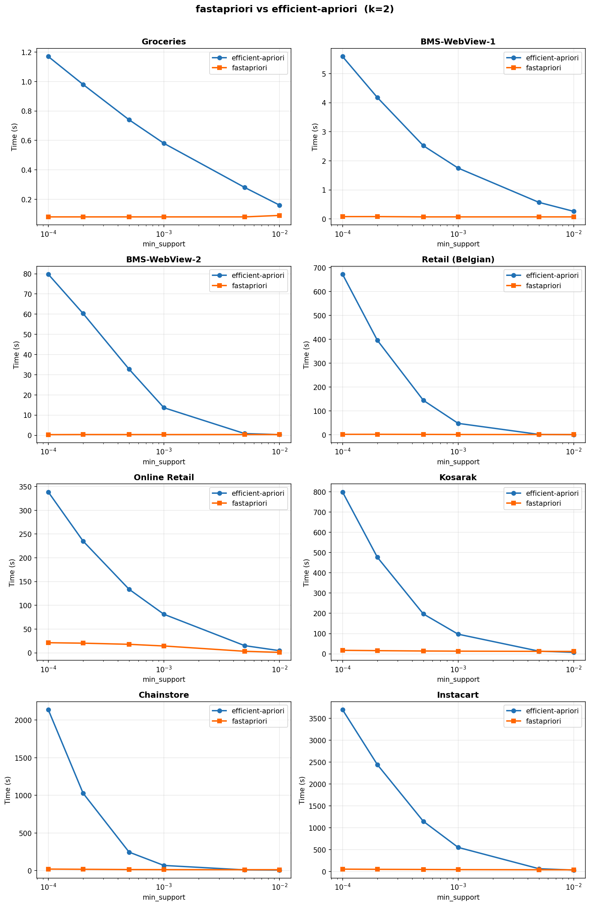
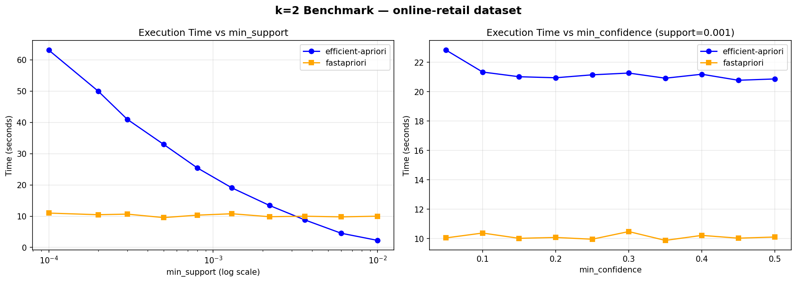

# fastapriori

<<<<<<< HEAD
Fast association rules mining even at low suppport

Built on a compiled **Rust engine** with an inverted-index architecture that counts exhaustively at k=2 and applies Apriori pruning at k>=3. Achieves **7-89x speedups** over efficient-apriori across eight real-world benchmark datasets.
=======
Fast pairwise (k=2) co-occurrence and association analysis for real-world, long-tail transactional data.

Uses a polars/pandas backend to compute all item-pair metrics. **5-10x faster** and **2-5x memory-efficient** than efficient-apriori on large datasets (>100k rows) with low support condition (<.01) and other conditions like confidence, lift, etc. Works well even for data with 10 million rows and no support criteria.
>>>>>>> c392119dc09b5e93d3d41dafb663a0e9d9e856f4

## Installation

```bash
pip install fastapriori
```

The Rust extension is included in the wheel. If building from source, you need the Rust toolchain ([rustup.rs](https://rustup.rs)):

```bash
pip install -e .
```

<<<<<<< HEAD
=======
If polars is not installed, fastapriori falls back to a pandas backend automatically.

>>>>>>> c392119dc09b5e93d3d41dafb663a0e9d9e856f4
## Quick Start

```python
import pandas as pd
from fastapriori import find_associations

# Transactional data: one row per (transaction, item) pair
df = pd.DataFrame({
    "txn_id": [1, 1, 1, 2, 2, 3, 3, 3],
    "item":   ["A", "B", "C", "A", "B", "B", "C", "D"],
})

# k=2 (default): pairwise associations with 7 metrics
pairs = find_associations(
    df,
    transaction_col="txn_id",
    item_col="item",
    min_support=0.01,
    min_confidence=0.1,
)

# k=3: triplet associations
triplets = find_associations(
    df,
    transaction_col="txn_id",
    item_col="item",
    k=3,
    min_support=0.01,
)
```

### k=2 Output Columns

| Column | Description |
|--------|-------------|
| `item_A` | Reference item |
| `item_B` | Co-occurring item |
| `instances` | Transactions containing both A and B |
| `support` | instances / total_transactions |
| `confidence` | P(B\|A) = instances / transactions_containing_A |
| `lift` | confidence / support(B) |
| `conviction` | (1 - support(B)) / (1 - confidence) |
| `leverage` | support(A,B) - support(A) * support(B) |
| `cosine` | support(A,B) / sqrt(support(A) * support(B)) |
| `jaccard` | support(A,B) / (support(A) + support(B) - support(A,B)) |

### k>=3 Output Columns

| Column | Description |
|--------|-------------|
| `antecedent_1` .. `antecedent_{k-1}` | Items in the antecedent |
| `consequent` | Predicted item |
| `instances` | Transactions containing all k items |
| `support` | instances / total_transactions |
| `confidence` | P(consequent \| antecedents) |
| `lift` | confidence / support(consequent) |

## Algorithm

fastapriori uses a **"count everything, prune later"** architecture:

- **k=2**: Builds an inverted index (item -> transaction set), then for each item counts ALL co-occurring items in a single pass using a flat array buffer. Runtime is **constant with respect to min_support** -- the threshold is applied as a post-hoc filter on precomputed counts.

- **k>=3**: Extends the same inverted index with **anchor-and-extend**: each frequent (k-1)-set serves as an anchor, and candidate k-th items are counted by scanning only the anchor's transactions. Apriori's downward-closure property is used to prune items that cannot participate in frequent k-sets.

This "best of both worlds" design applies brute-force counting where pruning cannot help (k=2) and principled pruning where it genuinely reduces work (k>=3).

### Three Algorithms

| Algorithm | Description | When to use |
|-----------|-------------|-------------|
| `algo="fast"` (default) | Inverted-index count-all | Best for most cases, especially low support |
| `algo="classic"` | Rust port of Apriori (join+prune+short-circuit) | Dense data (d_avg > 15) with high k (>=4) |
| `algo="auto"` | Routes to `"fast"` | Safe default |

## Performance

Benchmarked on eight real-world datasets at k=2 to 9, sweeping min_support from 0.0001 to 0.01:



**fastapriori's runtime is flat at k=2** across all support levels (it computes everything regardless), while efficient-apriori slows dramatically at low support.

For k>=3, fastapriori dominates asymptotically

**The risk is asymmetric:** when fastapriori is suboptimal (high support), the penalty is milliseconds. When efficient-apriori is suboptimal (low support), the penalty is 5-53 minutes.

### Verbose Mode

Use `verbose=True` to inspect dataset characteristics before a long run:

```python
find_associations(df, "txn_id", "item", k=4, min_support=0.001, verbose=True)
```

```
[fastapriori] Dataset: 28,816 txns x 4,632 items | 525,476 rows
[fastapriori] d_avg=18.2  d_max=539  d_median=11.0  d_std=16.3
[fastapriori] k=4  min_support=0.001  algo=fast
[fastapriori] WARNING: C(539, 3) x 28,816 = 752M combinations -- may be slow
```

## Metric Interpretation Guide

| Metric | Range | What it tells you | When to use |
|--------|-------|-------------------|-------------|
| **support** | 0 -- 1 | How frequently the pair appears across all transactions. | Filter out noise -- set a floor to focus on pairs that occur often enough to matter. |
| **confidence** | 0 -- 1 | P(B\|A) -- given item A was purchased, how likely is B? Directional. | Product recommendations -- "customers who bought A also bought B". |
| **lift** | 0 -- inf | How much more likely A and B co-occur than if independent. >1 = positive association, <1 = substitutes. | Best general-purpose metric. Filter with `lift > 1`. |
| **conviction** | 0.5 -- inf | How much the rule A->B would be wrong if A and B were independent. inf = always correct. | Preferred over confidence for strong directional rules. |
| **leverage** | -0.25 -- 0.25 | Absolute deviation from independence. 0 = independent. | When you want absolute (not relative) association strength. |
| **cosine** | 0 -- 1 | Symmetric similarity, not inflated by rare items like lift can be. | Clustering, similarity matrices. |
| **jaccard** | 0 -- 1 | Overlap coefficient -- fraction of transactions with A or B that contain both. | How "interchangeable" two items are. |

**Quick decision guide:**
- **Bundling / cross-sell** -> filter by `lift > 1` and `confidence > 0.1`
- **Substitute detection** -> look for `lift < 1`
- **Symmetric similarity** -> use `cosine` or `jaccard`
- **Directional rules** (A implies B) -> use `confidence` or `conviction`

## API Reference

### `find_associations()`

```python
find_associations(
    df,
    transaction_col,
    item_col,
    k=2,                    # itemset size (2-50)
    min_support=None,       # minimum pair support (float or None)
    min_confidence=0.0,     # minimum P(B|A)
    min_lift=0.0,           # minimum lift (k=2 only)
    min_conviction=0.0,     # minimum conviction (k=2 only)
    min_leverage=None,      # minimum leverage (k=2 only)
    min_cosine=0.0,         # minimum cosine similarity (k=2 only)
    min_jaccard=0.0,        # minimum Jaccard similarity (k=2 only)
    show_progress=False,    # tqdm progress bar (Python backend only)
    backend="auto",         # "auto", "rust", "python", "polars", "pandas"
    algo="fast",            # "fast", "classic", or "auto"
    sorted_by="support",    # sort column (or None to skip)
    low_memory=False,       # pre-filter infrequent items to reduce memory
    verbose=False,          # print dataset stats and density warnings
)
```

**Algorithm choice:**
- `"fast"` (default) -- inverted-index count-all. Runtime is constant w.r.t. support at k=2.
- `"classic"` -- Rust port of Apriori with join+prune+short-circuit. Requires `min_support`. Better for dense data (d_avg > 15) with high k (>=4).
- `"auto"` -- routes to `"fast"` (the safe default in all but edge cases).

**Backend choice:**
- `"auto"` (default) -- uses Rust if compiled extension is available, otherwise falls back to Python
- `"python"` -- polars for k=2 (falling back to pandas), counter_chain for k>=3
- Individual backends: `"rust"`, `"pandas"`, `"polars"`, `"counter_chain"`

### `get_top_associations()`

```python
from fastapriori import get_top_associations

# Top 10 items associated with "widget-A" by lift
top = get_top_associations(result, item="widget-A", metric="lift", n=10, role="any")
```

`role` controls direction: `"antecedent"` (item as item_A), `"consequent"` (item as item_B), or `"any"` (both).

### `filter_associations()`

```python
from fastapriori import filter_associations

# All associations involving one or more items
filtered = filter_associations(result, items=["widget-A", "widget-B"], role="any")
```

### `to_heatmap()`

```python
from fastapriori import to_heatmap

pivot = to_heatmap(result, metric="lift")  # returns a pivot table (item_A x item_B)
```

### `plot_heatmap()`

```python
from fastapriori import plot_heatmap

fig = plot_heatmap(result, metric="lift", cmap="RdYlGn", annot=True)
```

Requires `matplotlib`.

### `to_graph()`

```python
from fastapriori import to_graph

G = to_graph(result, metric="lift", min_value=1.5)  # returns networkx.DiGraph
```

Requires `networkx` (`pip install fastapriori[graph]`).

<<<<<<< HEAD
=======
## Performance

Benchmarked on the online-retail dataset, pairwise (k=2) associations — sweeping `min_support` and `min_confidence` side by side:



- **Left** — varying `min_support` (log scale 0.0001–0.01, confidence=0.0): execution time
- **Right** — varying `min_confidence` (0.05–0.50, support=0.001): execution time

Fastapriori can be **5-100x faster** than efficient-apriori depending upon the dataset size and the filtering conditions. 

## When to Use Something Else

fastapriori is currently optimized for **pairwise (k=2) associations only**. If you need higher-order itemsets (k=3, k=4, ...), use efficient-apriori.

>>>>>>> c392119dc09b5e93d3d41dafb663a0e9d9e856f4
## License

MIT
