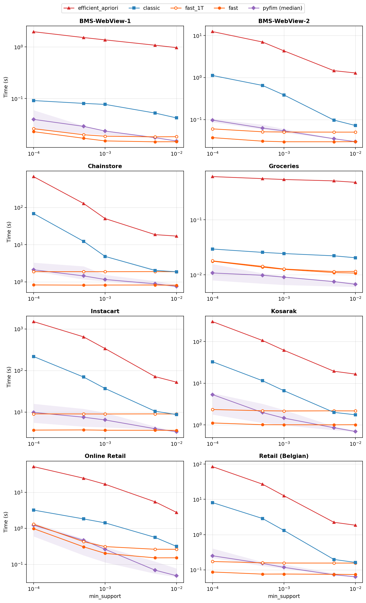

# fastapriori

[](https://pypi.org/project/fastapriori/)
[](https://pypi.org/project/fastapriori/)
[](https://opensource.org/licenses/MIT)
[](https://doi.org/10.5281/zenodo.20021781)

Fast frequent itemset mining (with full association-rule metrics at k=2) — even at very low support thresholds.

Built on a compiled **Rust engine** with an inverted-index architecture. fastapriori counts pair co-occurrences exhaustively at k=2 and uses an anchor-and-extend strategy with Apriori pruning at k>=3. Across **eight real-world datasets** (BMS-WebView-1/2, Chainstore, Groceries, Instacart, Kosarak, Online Retail, Retail Belgian — 9.8K to 3.2M transactions, 169 to 49K items), `algo="fast"` wins **100% of k=2 configurations vs `efficient-apriori`** (median 61x, up to **969x** on Retail Belgian) and **100% vs the like-for-like compiled Apriori baseline** at k=2 (median 3.9x, up to **92.8x**). At k>=3 it wins **91–97%** of configurations vs the same compiled-Apriori baseline (best 27–36x).

## Installation

```bash
pip install fastapriori
```

The Rust extension is included in the wheel. To build from source, you need the Rust toolchain ([rustup.rs](https://rustup.rs)):

```bash
pip install -e .
```

## Quick Start

```python
import pandas as pd
from fastapriori import find_associations

# Transactional data: one row per (transaction, item) pair
df = pd.DataFrame({
    "txn_id": [1, 1, 1, 2, 2, 3, 3, 3],
    "item":   ["A", "B", "C", "A", "B", "B", "C", "D"],
})

# k=2 (default): pairwise associations with 7 metrics
pairs = find_associations(
    df,
    transaction_col="txn_id",
    item_col="item",
    min_support=0.01,
    min_confidence=0.1,
)

# k=3: triplet associations
triplets = find_associations(
    df,
    transaction_col="txn_id",
    item_col="item",
    k=3,
    min_support=0.01,
)
```

### k=2 Output Columns

| Column | Description |
|--------|-------------|
| `item_A` | Reference item |
| `item_B` | Co-occurring item |
| `instances` | Transactions containing both A and B |
| `support` | instances / total_transactions |
| `confidence` | P(B\|A) = instances / transactions_containing_A |
| `lift` | confidence / support(B) |
| `conviction` | (1 - support(B)) / (1 - confidence) |
| `leverage` | support(A,B) - support(A) * support(B) |
| `cosine` | support(A,B) / sqrt(support(A) * support(B)) |
| `jaccard` | support(A,B) / (support(A) + support(B) - support(A,B)) |

### k>=3 Output Columns

| Column | Description |
|--------|-------------|
| `antecedent_1` .. `antecedent_{k-1}` | Items in the antecedent |
| `consequent` | Predicted item |
| `instances` | Transactions containing all k items |
| `support` | instances / total_transactions |
| `confidence` | P(consequent \| antecedents) |
| `lift` | confidence / support(consequent) |

## Why Low Support Matters

Classical Apriori relies on a high `min_support` to prune candidates. But the most valuable discoveries — long-tail specialty products, seasonal items, rare industrial part pairings, B2B bundles with 50,000-part catalogs — live exactly where support is low. On a 3.2M-transaction Instacart dataset at `s = 0.0001`, Apriori spends minutes pruning candidates that fastapriori never has to generate.

**fastapriori sidesteps this entirely at k=2**: compute every pair in a single pass, then filter on any metric afterward. No support threshold required.

## Algorithm

fastapriori uses a **"count everything, filter later"** architecture:

- **k=2**: Builds an inverted index (item -> transaction set), then for each item counts ALL co-occurring items in a single pass using a flat array buffer. Runtime is **constant with respect to min_support** — the threshold is applied as a post-hoc filter on precomputed counts.

- **k>=3**: Extends the same inverted index with **anchor-and-extend**: each frequent (k-1)-set serves as an anchor, and candidate k-th items are counted by scanning only the anchor's transactions. Apriori's downward-closure property prunes items that cannot participate in frequent k-sets.

This "best of both worlds" design applies brute-force counting where pruning cannot help (k=2) and principled pruning where it genuinely reduces work (k>=3).

### Three Algorithms

| Algorithm | Description | When to use |
|-----------|-------------|-------------|
| `algo="fast"` (default) | Inverted-index count-all | Best in the overwhelming majority of cases, especially at low support |
| `algo="classic"` | Rust port of Apriori (join + prune + short-circuit) | Dense, correlated data where k>=4 *and* the transaction-size tail is heavy |
| `algo="auto"` | Routes to `"fast"` | Safe default |

## Performance

Benchmarked on eight real-world datasets at k=2, sweeping `min_support` from 0.0001 to 0.01. Each method gets three repeats; the line shows the median, the band shows min–max:



Five lines per panel: `efficient_apriori` (Python Apriori), `classic` (compiled Rust Apriori — like-for-like control), `fast_1T` (single-threaded fastapriori), `fast` (parallel fastapriori), and `pyfim (median)` (a native-C reference baseline averaged over its three algorithms).

**fastapriori's runtime is flat at k=2** across all support levels — for every real dataset, the `fast` line varies by under 7% across the full support sweep (Chainstore: 0.82→0.83s; Instacart: 3.65→3.74s; Retail Belgian: 0.07→0.09s). `efficient_apriori` slows by 1–2 orders of magnitude as support drops; the `classic` line tracks `fast` at high support and diverges at low support — the textbook Apriori crossover, without the Python tax.

**The risk profile is asymmetric.** When `fast` is suboptimal (very high support, small data), the penalty is milliseconds. When Apriori is suboptimal (low support, large data), the penalty is minutes. Choosing `fast` by default costs you nothing in the worst case and saves everything in the common case.

| Real-world result (k=2, 8 datasets, 5 supports) | Wins | Median speedup | Best |
|--|--|--|--|
| `fast` vs `efficient_apriori` | **39 / 39 (100%)** | 61x | **969x** (Retail Belgian, s=10⁻⁴) |
| `fast` vs compiled Rust Apriori (`classic`) | **40 / 40 (100%)** | 3.9x | **92.8x** (Retail Belgian, s=10⁻⁴) |
| `fast` vs `pyfim` (native C; median of `apriori`, `eclat`, `fpgrowth`) | **26 / 40 (65%)** | 1.3x | **4.8x** (Kosarak, s=10⁻⁴) |

At k>=3 (same eight real datasets, k=3..9), `fast` beats the like-for-like compiled Apriori on **91–97% of configurations** with peak speedups of 27–36x. 
fastapriori gives competitive performance wrt pyfim (median) on k>=3 for wide, sparse, big data. For narrow, dense data at k>=4, prefer pyfim. 

## Decision Rule

```
Is k = 2?
  Yes -> use algo="fast"  (100% real-world win rate; constant runtime in min_support)

Is k >= 3?  Compute two one-pass stats:
    d_per_txn = df.groupby(transaction_col)[item_col].nunique()
    tau  = d_per_txn.max() / d_per_txn.mean()      # tail ratio
    d_cv = d_per_txn.std() / d_per_txn.mean()      # CV of basket size
    d_avg = d_per_txn.mean()

  Tame data (tau < 25  AND  d_cv < 1.25  AND  d_avg < 15)
    -> use algo="fast"
       e.g. Groceries (tau=7.3, cv=0.81, d_avg=4.4),
            Instacart (tau=14.4, cv=0.75, d_avg=10.1),
            Retail Belgian (tau=7.4, cv=0.79, d_avg=10.3),
            Chainstore (tau=23.5, cv=1.23, d_avg=7.2)

  Heavy outlier tail (tau >= 25 or d_cv >= 1.25), e.g. BMS-WebView-1/2, Kosarak
    -> k = 3:    use algo="fast"
       k >= 4:   use algo="fast" with max_items_per_txn=50
                 (caps the C(d_max, k-1) blow-up; counts become lower bounds)

  Dense baskets (d_avg >= 15), e.g. Online Retail (d_avg=18.2)
    -> consider algo="classic" with a real min_support;
       or algo="fast" with max_items_per_txn=50
```

If you don't want to think about it, `algo="fast"` is the right answer everywhere except the dense-and-high-k corner — and even there the penalty is bounded by `max_items_per_txn`.

## Handling Dense / Outlier Transactions: `max_items_per_txn`

When a few transactions are huge — think Online Retail with `d_max = 539`, or Kosarak with `d_max = 2,498` — the per-transaction enumeration cost at k>=3 is dominated by those outliers (you enumerate C(d, k-1) items per transaction). fastapriori supports an opt-in cap that truncates each transaction to its top-N items by weight:

```python
result = find_associations(
    df, "txn_id", "item",
    k=4,
    min_support=0.001,
    max_items_per_txn=50,      # cap outliers: 539 -> 50 items for the largest basket
    item_weights=None,          # default: rank by global item frequency (keeps frequent items)
)
```

- **What it does.** Transactions with more than N items are reduced to their top-N by weight. Others are left untouched.
- **Counts are lower bounds.** A capped itemset's count is never higher than the true count; some genuinely frequent itemsets may be missed if their count drops below `min_support` after capping. Use it when you *prefer a fast, conservative answer* to a slow, exact one.
- **Custom weights.** Pass an `item_weights={item: score}` dict to prioritize high-revenue / high-margin / business-critical items regardless of frequency.
- **Only applies at k>=3.** Pairs are always counted exactly. Supported by both `algo="fast"` and `algo="classic"`.
- **When it pays off.** On Online Retail at k=4 with cap=50, per-anchor enumeration cost drops by ~1,300x; on Kosarak, ~133,000x.

## Low-Memory Mode

The pair counter scales as O(m^2) in the unique-item count. Instacart (~50k items) uses ~1.5 GB at `s = 0.0001`. `low_memory=True` pre-filters items below `min_support` before building the index — typically a 5–10x memory reduction on large catalogs:

```python
find_associations(df, "txn_id", "item", min_support=0.001, low_memory=True)
```

Requires `min_support`. Results are exact because the dropped items could not have met the threshold in the first place.

## Verbose Mode

Use `verbose=True` to inspect dataset characteristics before a long run:

```python
find_associations(df, "txn_id", "item", k=4, min_support=0.001, verbose=True)
```

```
[fastapriori] Dataset: 28,816 txns x 4,632 items | 525,476 rows
[fastapriori] d_avg=18.2  d_max=539  d_median=11.0  d_std=16.3
[fastapriori] k=4  min_support=0.001  algo=fast
[fastapriori] WARNING: C(539, 3) x 28,816 = 752M combinations -- may be slow
```

A warning fires when `C(d_max, k-1) * n_transactions` exceeds 10^8 — a good cue to consider `max_items_per_txn`.

## Metric Interpretation Guide

| Metric | Range | What it tells you | When to use |
|--------|-------|-------------------|-------------|
| **support** | 0 — 1 | How frequently the pair appears across all transactions. | Filter out noise — set a floor to focus on pairs that occur often enough to matter. |
| **confidence** | 0 — 1 | P(B\|A) — given item A was purchased, how likely is B? Directional. | Product recommendations — "customers who bought A also bought B". |
| **lift** | 0 — inf | How much more likely A and B co-occur than if independent. >1 = positive association, <1 = substitutes. | Best general-purpose metric. Filter with `lift > 1`. |
| **conviction** | 0.5 — inf | How much the rule A->B would be wrong if A and B were independent. inf = always correct. | Preferred over confidence for strong directional rules. |
| **leverage** | -0.25 — 0.25 | Absolute deviation from independence. 0 = independent. | When you want absolute (not relative) association strength. |
| **cosine** | 0 — 1 | Symmetric similarity, not inflated by rare items like lift can be. | Clustering, similarity matrices. |
| **jaccard** | 0 — 1 | Overlap coefficient — fraction of transactions with A or B that contain both. | How "interchangeable" two items are. |

**Quick decision guide:**
- **Bundling / cross-sell** -> filter by `lift > 1` and `confidence > 0.1`
- **Substitute detection** -> look for `lift < 1`
- **Symmetric similarity** -> use `cosine` or `jaccard`
- **Directional rules** (A implies B) -> use `confidence` or `conviction`

## Practical Workflow: Run Once, Filter Many Times

Because `fast` k=2 runtime is constant in `min_support`, you can compute the full co-occurrence table once with `min_support=None` and then filter interactively. Each threshold change is a pandas filter, not a recompute:

```python
full = find_associations(df, "txn_id", "item")           # computes everything
strong = full[(full["lift"] > 2) & (full["confidence"] > 0.3)]
rare   = full[full["instances"] == 1]                    # anomaly / error detection
substitutes = full[full["lift"] < 1]
```

`min_support=None` also surfaces pairs that *never* co-occur (zero support) and cold-start items with few transactions — both often filtered away by traditional Apriori before you ever see them.

## API Reference

### `find_associations()`

```python
find_associations(
    df,
    transaction_col,
    item_col,
    k=2,                     # itemset size (2-50)
    min_support=None,        # minimum pair support (float or None)
    min_confidence=0.0,      # minimum P(B|A)
    min_lift=0.0,            # minimum lift
    min_conviction=0.0,      # minimum conviction (k=2 only)
    min_leverage=None,       # minimum leverage (k=2 only)
    min_cosine=0.0,          # minimum cosine similarity (k=2 only)
    min_jaccard=0.0,         # minimum Jaccard similarity (k=2 only)
    max_items_per_txn=None,  # cap outlier transactions (k>=3, fast + classic)
    item_weights=None,       # dict for custom ranking used by max_items_per_txn
    low_memory="auto",       # pre-filter infrequent items to reduce memory
    show_progress=False,     # tqdm progress bar
    backend="auto",          # "auto", "rust", "python", "polars", "pandas"
    algo="fast",             # "fast", "classic", or "auto"
    sorted_by="support",     # sort column (or None to skip)
    verbose=False,           # print dataset stats and density warnings
)
```

**Algorithm choice:**
- `"fast"` (default) — inverted-index count-all. Constant runtime at k=2 (100% real-world wins); 91–97% wins vs the compiled Apriori control across k=3..9 on real datasets.
- `"classic"` — Rust port of Apriori with join+prune+short-circuit. Requires `min_support`. Potentially useful for dense, correlated data at k>=4 where the transaction-size tail violates the `tau < 25 and d_cv < 1.25` heuristic above.
- `"auto"` — routes to `"fast"` (the safe default in all but edge cases).

**Backend choice:**
- `"auto"` (default) — uses Rust if the compiled extension is available, otherwise falls back to Python.
- `"python"` — polars for k=2 (falling back to pandas), counter_chain for k>=3.
- Individual backends: `"rust"`, `"pandas"`, `"polars"`, `"counter_chain"`.

### `get_top_associations()`

```python
from fastapriori import get_top_associations

# Top 10 items associated with "widget-A" by lift
top = get_top_associations(result, item="widget-A", metric="lift", n=10, role="any")
```

`role` controls direction: `"antecedent"` (item as item_A), `"consequent"` (item as item_B), or `"any"` (both).

### `filter_associations()`

```python
from fastapriori import filter_associations

# All associations involving one or more items
filtered = filter_associations(result, items=["widget-A", "widget-B"], role="any")
```

### `to_heatmap()`

```python
from fastapriori import to_heatmap

pivot = to_heatmap(result, metric="lift")  # returns a pivot table (item_A x item_B)
```

### `plot_heatmap()`

```python
from fastapriori import plot_heatmap

fig = plot_heatmap(result, metric="lift", cmap="RdYlGn", annot=True)
```

Requires `matplotlib`.

### `to_graph()`

```python
from fastapriori import to_graph

G = to_graph(result, metric="lift", min_value=1.5)  # returns networkx.DiGraph
```

Requires `networkx` (`pip install fastapriori[graph]`).

## Limitations

- **Memory at low s, large m**: the pair counter scales O(m^2); on Instacart (~50k items) expect ~1.5 GB at `s = 10^-4`. Use `low_memory=True` when you have a `min_support`.
- **Dense data at high k**: the combinatorial C(d_max, k-1) term is fundamental. `max_items_per_txn` bounds it at the cost of lower-bound counts.
- **Single-machine**: no distributed (Spark / Dask) version is provided.

## Citation

If you use *fastapriori* in your research, please cite both the
software (Zenodo) and the accompanying paper.

**Software (Zenodo):**

```bibtex
@software{swet2026fastapriori_software,
  author    = {Mrigank Swet},
  title     = {fastapriori: A Hybrid Architecture for Fast Frequent Itemset Mining},
  year      = {2026},
  publisher = {Zenodo},
  doi       = {10.5281/zenodo.20021781},
  url       = {https://doi.org/10.5281/zenodo.20021781}
}
```

The DOI above is the **Concept DOI** — it always resolves to the
latest version of the deposit. If you need to pin to a specific
snapshot, use the version-specific DOI from the corresponding
Zenodo record.

**Paper:**

```bibtex
@misc{swet2026fastapriori,
  author = {Mrigank Swet},
  title  = {A Hybrid Architecture for Fast Frequent Itemset Mining},
  year   = {2026},
  url    = {https://github.com/swetmr/fastapriori}
}
```


## Reproducibility

The Zenodo deposit at
[https://doi.org/10.5281/zenodo.20021781](https://doi.org/10.5281/zenodo.20021781)
contains the complete reproducibility artifact: source code, raw
run logs, aggregated benchmark CSVs, dataset-preprocessing scripts,
and synthetic-data generator parameters. See Appendix F of the
paper for the full hardware/software environment and reproduction
instructions.

## License

MIT — see [LICENSE](LICENSE).
